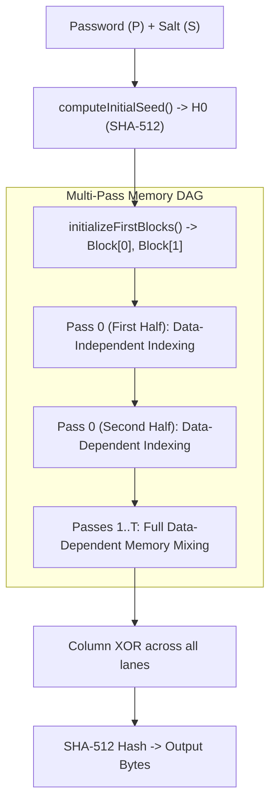

# Engine Architecture & Code Internals

`@epoch32/aura` is a zero-dependency, pure TypeScript engine implementing the **Asymmetric Unkeyed-Resistant Algorithm (AURA)**, an **Asymmetric Memory-Hard Function (aMHF)** and **Hybrid KDF** optimized for edge runtimes and browsers.

---

## 1. Directory Structure

```
aura/
├── src/
│   ├── core/
│   │   ├── block.ts       # 1024-byte block ARX quarter-rounds & mixing functions
│   │   ├── memory-dag.ts  # Memory matrix allocation & 2-phase indexing passes
│   │   └── aura.ts        # High-level Aura API (hash, deriveKey, sealWithTrapdoor, verify)
│   ├── trapdoor/
│   │   └── trapdoor.ts    # Asymmetric trapdoor tokens & public anchor verification
│   ├── encoding/
│   │   └── bytes.ts       # Zero-dep byte conversions, Base64URL, and hex utilities
│   └── index.ts           # Public exports
├── tests/
│   ├── block.test.ts      # Block XOR & ARX diffusion tests
│   ├── memory-dag.test.ts # Hybrid, independent, dependent DAG tests
│   ├── trapdoor.test.ts   # Instant O(1) trapdoor vs memory-hard fallback tests
│   └── aura.test.ts       # High-level PHC string & KDF tests
└── package.json
```

---

## 2. Core Execution Pipeline



---

## 3. Engine Optimizations

1. **Contiguous Buffer Allocation**: The entire memory arena is allocated as a single contiguous `ArrayBuffer`, sliced into zero-copy `Uint32Array` views.
2. **Native 32-bit Arithmetic**: All ARX operations (`rotl`, `+`, `^`) utilize 32-bit integer arithmetic which maps directly to native CPU registers in V8 / workerd JIT compilers.
3. **WebCrypto Acceleration**: Initial seed expansion and final digest calculations leverage host AES-NI / SHA hardware instructions.
