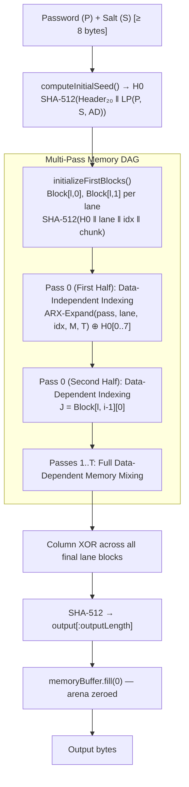

# Engine Architecture & Code Internals

`@epoch32/aura` is a zero-dependency, pure TypeScript engine implementing the **Asymmetric Unkeyed-Resistant Algorithm (AURA)**, an **Asymmetric Memory-Hard Function (aMHF)** and **Hybrid KDF** optimized for edge runtimes and browsers.

---

## 1. Directory Structure

```
aura/
├── src/
│   ├── core/
│   │   ├── block.ts       # 1024-byte block ARX quarter-rounds & mixing functions
│   │   ├── memory-dag.ts  # Memory matrix allocation, 2-phase indexing passes, arena zeroing
│   │   └── aura.ts        # High-level Aura API (hash, deriveKey, sealWithTrapdoor, verify)
│   ├── trapdoor/
│   │   └── trapdoor.ts    # HMAC-SHA256 public anchor & HKDF vault masking
│   ├── encoding/
│   │   └── bytes.ts       # Zero-dep byte conversions, strict Base64URL, hex, and LP encoding
│   └── index.ts           # Public exports
├── tests/
│   ├── block.test.ts      # Block XOR & ARX diffusion tests
│   ├── memory-dag.test.ts # Hybrid, independent, dependent DAG tests
│   ├── trapdoor.test.ts   # O(1) trapdoor, masked vault, PHC validation, and safety guard tests
│   └── aura.test.ts       # High-level PHC string & KDF tests
└── package.json
```

---

## 2. Core Execution Pipeline



---

## 3. Engine Optimizations

1. **Contiguous Buffer Allocation**: The entire memory arena is allocated as a single contiguous `ArrayBuffer`, sliced into zero-copy `Uint32Array` views. This maximises CPU cache locality and avoids GC pressure from many small allocations.
2. **Native 32-bit Arithmetic**: All ARX operations (`rotl`, `+`, `^`) utilize 32-bit integer arithmetic which maps directly to native CPU registers in V8 / workerd JIT compilers.
3. **WebCrypto Acceleration**: Initial seed expansion and final digest calculations leverage host AES-NI / SHA hardware instructions via `crypto.subtle`.
4. **Memory Arena Zeroing**: After `execute()` completes and the output is sliced off, the full arena is zeroed via `new Uint8Array(this.memoryBuffer).fill(0)`. This clears all intermediate graph state from the heap, reducing the window in which intermediate values are accessible in long-running serverless processes.

---

## 4. Security Hardening

### 4.1 Input Validation

All public API entry points enforce strict input constraints before any cryptographic work begins:

| Check | Entry Point | Action |
| :--- | :--- | :--- |
| Salt ≥ 8 bytes | `deriveKey()`, `hash()`, `sealWithTrapdoor()` | Throws |
| Trapdoor key ≥ 16 bytes | `sealWithTrapdoor()`, `TrapdoorEngine` | Throws |
| `memoryCostKb` in [8, 65536] | `verify()` (PHC + envelope), `MemoryDag` constructor | Returns `false` / throws |
| `timeCost` in [1, 64] | `verify()` (PHC + envelope) | Returns `false` |
| `parallelism` in [1, 16] | `verify()` (PHC + envelope) | Returns `false` |
| `mode` ∈ {hybrid, independent, dependent} | `verify()` (PHC + envelope) | Returns `false` |
| `dagOutput` / hash decoded length ≤ 64 bytes | `verify()` (PHC + envelope) — pre-decode check | Returns `false` |
| Strict base64url alphabet | `base64UrlToBytes()` | Throws |
| Strict hex alphabet | `hexToBytes()` | Throws |
| `MemoryDag` single-use guard | `MemoryDag.execute()` | Throws |

All exceptions thrown inside `verify()` are caught and returned as `false` — callers always receive a boolean.

### 4.2 Constant-Time Comparison

`constantTimeEqual(a, b)` accumulates differences over the full `max(a.length, b.length)` loop without early exit. The length mismatch itself is folded into `diff` as `a.length ^ b.length`, so timing does not reveal the expected hash length.

### 4.3 Length-Prefix Encoding

All multi-field HMAC and SHA-512 inputs use `encodeLengthPrefixed()` (4-byte LE length prefix per field) to prevent ambiguous-concatenation attacks where `(pwd="abc", salt="defg")` and `(pwd="abcd", salt="efg")` would otherwise produce identical byte streams.

### 4.4 Password-Bound Address Block

In data-independent indexing mode, the 256-word address block is initialized with `(pass, lane, index, memoryCostKb, timeCost)` and then XOR'd with the first 8 uint32 words of H0 before permutation. This binds the access pattern to the password, preventing an attacker from precomputing the traversal graph once and reusing it across all cracking attempts against the same configuration.

### 4.5 Masked Vault Mode (Default)

`sealWithTrapdoor()` defaults to `masked: true`. The stored `dagOutput` is XOR'd with `HKDF-SHA256(K, S, "aura:vault:mask")` before storage, rendering it indistinguishable from random bytes to anyone without K. Combined with the HMAC-keyed public anchor, offline dictionary attacks are mathematically blocked.
